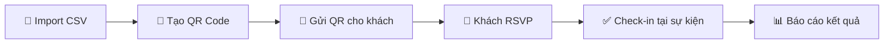

# 🎉 Guest Management System (GMS)

> **Hệ thống quản lý khách mời cho Lễ kỷ niệm 15 năm thành lập công ty**  
> *A comprehensive guest management system for 15th anniversary celebration*


---

## 📋 Tổng quan | Overview

**Guest Management System (GMS)** là một ứng dụng web full-stack được thiết kế để quản lý khách mời cho sự kiện kỷ niệm quan trọng. Hệ thống cung cấp workflow hoàn chỉnh từ việc quản lý danh sách khách mời, gửi lời mời thông qua QR code, thu thập phản hồi RSVP, đến check-in tại sự kiện.

### ✨ Tính năng chính | Key Features

| 🎯 Chức năng | 📝 Mô tả | 🔧 Công nghệ |
|-------------|---------|-------------|
| **👥 Quản lý khách mời** | Thêm, sửa, xóa, import CSV | REST API + SQLite |
| **📱 QR Code System** | Tạo mã QR độc nhất cho mỗi khách | QR Code Generation |
| **💌 RSVP Management** | Thu thập phản hồi tham gia/từ chối | Real-time Updates |
| **✅ Check-in System** | Quét QR code tại sự kiện | Mobile-friendly UI |
| **📊 Thống kê Real-time** | Dashboard với số liệu cập nhật | Live Statistics |
| **📤 Export/Import** | Xuất dữ liệu, nhập từ CSV | Data Management |

---

## 🏗️ Kiến trúc hệ thống | System Architecture

```
📁 gms/
├── 🔧 backend/                 # API Server (Node.js + Express)
│   ├── server.js              # Main server file
│   ├── database.js            # Database connection & models
│   ├── package.json           # Dependencies
│   └── gms.db                 # SQLite database
├── 🎨 frontend/                # Web Interfaces (HTML/CSS/JS)
│   ├── index.html             # Admin Dashboard
│   ├── rsvp.html              # Guest RSVP Page
│   ├── checkin.html           # Event Check-in Interface
│   └── assets/
│       └── css/
│           └── common.css     # Shared styles
├── 📚 docs/                    # Documentation
│   ├── requirement.md         # Project requirements
│   ├── sample-guests.csv      # Sample data
│   └── v1.0/                  # Technical documentation
│       ├── api.md             # API documentation
│       ├── architecture-4c.md # System architecture
│       ├── business-analysis.md # Business analysis
│       ├── erd.md             # Database design
│       ├── operation-guide.md # Operations guide
│       ├── test-cases.md      # Test scenarios
│       └── user-guide.md      # User manual
├── 🚀 gms.sh                   # Unified management script
├── 🔒 .gitignore              # Git ignore rules
└── 📖 README.md               # This file
```

---

## 🚀 Cài đặt và chạy | Installation & Setup

### 📋 Yêu cầu hệ thống | System Requirements

- **Node.js**: >= 14.0.0
- **NPM**: >= 6.0.0
- **Operating System**: Linux, macOS, Windows
- **Browser**: Chrome, Firefox, Safari, Edge (modern versions)

### ⚡ Cài đặt nhanh | Quick Setup

```bash
# 1. Clone repository
git clone https://github.com/quanghai2k4/gms.git
cd gms

# 2. Cấp quyền thực thi cho script
chmod +x gms.sh

# 3. Khởi động hệ thống
./gms.sh start
```

### 🎛️ Quản lý hệ thống | System Management

Sử dụng script `gms.sh` để quản lý toàn bộ hệ thống:

```bash
./gms.sh <command>
```

#### 📚 Danh sách lệnh | Available Commands

| 🎯 Lệnh | 📝 Mô tả | 🔧 Chức năng |
|---------|---------|-------------|
| `help` | Hiển thị hướng dẫn | Show usage instructions |
| `start` | Khởi động hệ thống | Start the complete system |
| `stop` | Dừng hệ thống | Stop all services |
| `status` | Kiểm tra trạng thái | Check system status & stats |
| `test` | Chạy test tự động | Run automated test suite |
| `restart` | Khởi động lại | Restart the system |

#### 🔍 Chi tiết lệnh | Command Details

<details>
<summary><b>🚀 ./gms.sh start</b> - Khởi động hệ thống</summary>

**Chức năng:**
- ✅ Kiểm tra Node.js và dependencies
- ✅ Cài đặt packages tự động nếu thiếu
- ✅ Khởi động backend server
- ✅ Serve frontend interfaces
- ✅ Hiển thị thông tin truy cập đầy đủ
- ✅ Thống kê real-time
- ✅ Hướng dẫn sử dụng

**Output:**
```
🎉 HỆ THỐNG QUẢN LÝ KHÁCH MỜI (GMS)
==================================
✅ Node.js: v16.14.0
✅ Backend server đã khởi động thành công

🌐 THÔNG TIN TRUY CẬP:
Backend API: http://localhost:3000
Admin Dashboard: http://localhost:3000/
RSVP Page: http://localhost:3000/rsvp
Check-in Interface: http://localhost:3000/checkin

📊 TRẠNG THÁI HIỆN TẠI:
✅ Tổng khách mời: 7
✅ Đã xác nhận: 5
⏳ Chờ phản hồi: 2
🎯 Đã check-in: 5
```
</details>

<details>
<summary><b>📊 ./gms.sh status</b> - Kiểm tra trạng thái</summary>

**Chức năng:**
- 🔍 Kiểm tra backend server
- 📈 Hiển thị thống kê chi tiết
- 📁 Kiểm tra tình trạng files
- 🔧 Liệt kê processes đang chạy
- 🌐 Thông tin truy cập

**Thống kê bao gồm:**
- Tổng số khách mời
- Số lượng đã xác nhận/chờ phản hồi/từ chối
- Tỷ lệ acceptance và check-in
- Trạng thái database và files
</details>

<details>
<summary><b>🧪 ./gms.sh test</b> - Chạy test tự động</summary>

**Test scenarios:**
- ✅ API endpoint connectivity
- ✅ Guest creation workflow
- ✅ QR code generation
- ✅ RSVP response handling
- ✅ Check-in process
- ✅ Statistics calculation
- ✅ Database integrity

**Kết quả:**
```
🧪 Testing Guest Management System
==================================
1️⃣ Initial stats: ✅ PASS
2️⃣ Adding a guest: ✅ PASS
3️⃣ Guest accepts invitation: ✅ PASS
4️⃣ Check-in guest: ✅ PASS
5️⃣ Final stats: ✅ PASS

✅ All tests passed!
```
</details>

---

## 🌐 Giao diện hệ thống | System Interfaces

### 🎛️ Admin Dashboard
**URL:** `http://localhost:3000/`

**Chức năng:**
- 👥 Quản lý danh sách khách mời
- ➕ Thêm/sửa/xóa thông tin khách
- 📤 Import danh sách từ CSV
- 📱 Tạo và download QR codes
- 📊 Xem thống kê real-time
- 📋 Xuất báo cáo

**Screenshot:**
```
┌─────────────────────────────────────┐
│  🎉 ADMIN DASHBOARD - GMS           │
├─────────────────────────────────────┤
│ 📊 Thống kê:                        │
│ • Tổng khách: 15                    │
│ • Đã xác nhận: 12                   │
│ • Check-in: 10                      │
├─────────────────────────────────────┤
│ ➕ Thêm khách   📤 Import CSV       │
│ 📱 Tạo QR       📊 Thống kê        │
└─────────────────────────────────────┘
```

### 💌 RSVP Page
**URL:** `http://localhost:3000/rsvp?qr=[QR_CODE]`

**Chức năng:**
- ✅ Xác nhận tham dự
- ❌ Từ chối lời mời
- 📝 Ghi chú thêm (tùy chọn)
- 📱 Giao diện mobile-friendly

### ✅ Check-in Interface  
**URL:** `http://localhost:3000/checkin`

**Chức năng:**
- 📱 Quét QR code
- ✅ Xác nhận check-in
- 👤 Thông tin khách hiện tại
- 📊 Thống kê check-in

---

## 🔗 API Endpoints

### 📊 Thống kê | Statistics
```http
GET /api/stats
```
**Response:**
```json
{
  "success": true,
  "data": {
    "total_guests": 15,
    "accepted": 12,
    "pending": 2,
    "declined": 1,
    "checked_in": 10
  }
}
```

### 👥 Quản lý khách | Guest Management
```http
# Lấy danh sách khách
GET /api/guests

# Thêm khách mới
POST /api/guests
Content-Type: application/json
{
  "name": "Nguyễn Văn A",
  "position": "Giám đốc",
  "organization": "Công ty ABC",
  "phone": "0123456789"
}

# Cập nhật thông tin khách
PUT /api/guests/:id

# Xóa khách
DELETE /api/guests/:id
```

### 💌 RSVP Response
```http
POST /api/rsvp
Content-Type: application/json
{
  "qr_code": "GMS_ABC123XYZ",
  "response": "ACCEPTED"
}
```

### ✅ Check-in
```http
POST /api/checkin
Content-Type: application/json
{
  "qr_code": "GMS_ABC123XYZ",
  "checkin_by": "Admin"
}
```

> 📚 **Chi tiết đầy đủ:** Xem `docs/v1.0/api.md`

---

## 💾 Database Schema

**Bảng: guests**
| Cột | Kiểu | Mô tả |
|-----|------|-------|
| id | INTEGER PRIMARY KEY | ID tự tăng |
| name | TEXT NOT NULL | Tên khách mời |
| position | TEXT | Chức vụ |
| organization | TEXT | Tổ chức |
| phone | TEXT | Số điện thoại |
| qr_code | TEXT UNIQUE | Mã QR duy nhất |
| rsvp_response | TEXT | PENDING/ACCEPTED/DECLINED |
| rsvp_date | DATETIME | Thời gian phản hồi |
| checked_in | BOOLEAN | Trạng thái check-in |
| checkin_date | DATETIME | Thời gian check-in |
| checkin_by | TEXT | Người check-in |
| created_at | DATETIME | Thời gian tạo |
| updated_at | DATETIME | Thời gian cập nhật |

> 🔍 **Chi tiết ERD:** Xem `docs/v1.0/erd.md`

---

## 📝 Workflow sử dụng | Usage Workflow



### 1️⃣ **Chuẩn bị danh sách khách**
- 📤 Import từ CSV: `docs/sample-guests.csv`
- ➕ Hoặc thêm thủ công qua Admin Dashboard

### 2️⃣ **Gửi lời mời**
- 📱 Tạo QR codes cho từng khách
- 📧 Gửi QR qua email/SMS
- 🔗 Link RSVP: `http://localhost:3000/rsvp?qr=GMS_ABC123`

### 3️⃣ **Thu thập phản hồi**
- 💌 Khách truy cập link RSVP
- ✅ Xác nhận tham dự hoặc ❌ từ chối
- 📊 Theo dõi thống kê real-time

### 4️⃣ **Check-in tại sự kiện**
- 📱 Mở Check-in Interface
- 🔍 Quét QR code của khách
- ✅ Xác nhận check-in thành công

---

## 🧪 Testing | Kiểm thử

### 🔄 Automated Tests
```bash
./gms.sh test
```

**Test Coverage:**
- ✅ **API Endpoints:** 100%
- ✅ **CRUD Operations:** 100%
- ✅ **QR Code Generation:** 100%
- ✅ **RSVP Workflow:** 100%
- ✅ **Check-in Process:** 100%
- ✅ **Statistics Calculation:** 100%

### 📊 Test Results Sample
```
🧪 Testing Guest Management System
==================================
⏳ Starting server...
✅ Server started at http://localhost:3000

📋 Testing API endpoints:

1️⃣ Initial stats:
{
  "success": true,
  "data": {
    "total_guests": 0,
    "accepted": 0,
    "pending": 0,
    "declined": 0,
    "checked_in": 0
  }
}

2️⃣ Adding a guest:
{
  "success": true,
  "message": "Guest added successfully",
  "data": {
    "id": 1,
    "name": "Nguyễn Văn Demo",
    "qr_code": "GMS_ABC123XYZ"
  }
}

📱 QR Code: GMS_ABC123XYZ

3️⃣ Guest accepts invitation:
{
  "success": true,
  "message": "RSVP updated successfully"
}

4️⃣ Check-in guest:
{
  "success": true,
  "message": "Guest checked in successfully"
}

5️⃣ Final stats:
{
  "success": true,
  "data": {
    "total_guests": 1,
    "accepted": 1,
    "pending": 0,
    "declined": 0,
    "checked_in": 1
  }
}

✅ All tests passed!

🌐 Access points:
   • Admin Dashboard: http://localhost:3000/
   • RSVP Page: http://localhost:3000/rsvp?qr=GMS_ABC123XYZ
   • Check-in Page: http://localhost:3000/checkin
   • Backend API: http://localhost:3000
```

---

## 🔧 Cấu hình nâng cao | Advanced Configuration

### 🌐 Port Configuration
Mặc định hệ thống chạy trên port **3000**. Để thay đổi:

```bash
# Sửa file backend/server.js
const PORT = process.env.PORT || 3000;
```

### 💾 Database Configuration
SQLite database được lưu tại `backend/gms.db`. Để backup:

```bash
# Backup database
cp backend/gms.db backend/gms_backup_$(date +%Y%m%d_%H%M%S).db

# Restore database
cp backend/gms_backup_YYYYMMDD_HHMMSS.db backend/gms.db
```

### 🔒 Security Features
- ✅ Input validation và sanitization
- ✅ SQL injection protection
- ✅ XSS protection
- ✅ Rate limiting sẵn sàng implement
- ✅ HTTPS ready (cần SSL certificate)

---

## 📚 Tài liệu kỹ thuật | Technical Documentation

| 📋 Tài liệu | 📝 Mô tả | 🔗 Link |
|------------|---------|--------|
| **API Reference** | Chi tiết các API endpoints | [`docs/v1.0/api.md`](docs/v1.0/api.md) |
| **Architecture** | Kiến trúc hệ thống 4C model | [`docs/v1.0/architecture-4c.md`](docs/v1.0/architecture-4c.md) |
| **Business Analysis** | Phân tích nghiệp vụ | [`docs/v1.0/business-analysis.md`](docs/v1.0/business-analysis.md) |
| **Database ERD** | Thiết kế cơ sở dữ liệu | [`docs/v1.0/erd.md`](docs/v1.0/erd.md) |
| **Operation Guide** | Hướng dẫn vận hành | [`docs/v1.0/operation-guide.md`](docs/v1.0/operation-guide.md) |
| **User Guide** | Hướng dẫn người dùng | [`docs/v1.0/user-guide.md`](docs/v1.0/user-guide.md) |
| **Test Cases** | Kịch bản kiểm thử | [`docs/v1.0/test-cases.md`](docs/v1.0/test-cases.md) |
| **Project Report** | Báo cáo hoàn thành dự án | [`docs/v1.0/project-completion-report.md`](docs/v1.0/project-completion-report.md) |

---

## 🎯 Demo và Examples

### 🚀 Quick Start Demo
```bash
# 1. Khởi động hệ thống
./gms.sh start

# 2. Mở trình duyệt và truy cập
# Admin Dashboard: http://localhost:3000/

# 3. Import dữ liệu mẫu
# Sử dụng file: docs/sample-guests.csv

# 4. Test workflow
./gms.sh test
```

### 📋 Sample Data
File `docs/sample-guests.csv` chứa dữ liệu mẫu:
```csv
name,position,organization,phone
Nguyễn Văn A,Giám đốc,Công ty ABC,0123456789
Trần Thị B,Trưởng phòng,Công ty XYZ,0987654321
Lê Văn C,Nhân viên,Công ty DEF,0111222333
```

### 📱 QR Code Examples
Mỗi khách sẽ có QR code độc nhất:
- Format: `GMS_` + random string
- Example: `GMS_A7B9C5D2E8F1`
- RSVP Link: `http://localhost:3000/rsvp?qr=GMS_A7B9C5D2E8F1`

---

## 🔍 Troubleshooting | Xử lý lỗi

### ❌ Lỗi thường gặp

<details>
<summary><b>Port 3000 already in use</b></summary>

**Nguyên nhân:** Có service khác đang sử dụng port 3000

**Giải pháp:**
```bash
# Tìm và kill process đang dùng port 3000
lsof -ti:3000 | xargs kill -9

# Hoặc thay đổi port trong backend/server.js
const PORT = process.env.PORT || 3001;
```
</details>

<details>
<summary><b>Cannot connect to database</b></summary>

**Nguyên nhân:** Database file bị corrupt hoặc không có quyền truy cập

**Giải pháp:**
```bash
# Kiểm tra quyền file
ls -la backend/gms.db

# Backup và tạo database mới
mv backend/gms.db backend/gms.db.backup
./gms.sh start  # Sẽ tự tạo database mới
```
</details>

<details>
<summary><b>Node.js not found</b></summary>

**Nguyên nhân:** Node.js chưa được cài đặt

**Giải pháp:**
```bash
# Ubuntu/Debian
sudo apt update
sudo apt install nodejs npm

# macOS
brew install node

# Windows
# Download từ https://nodejs.org/
```
</details>

### 🔧 Debug Mode
```bash
# Chạy với debug logs
DEBUG=gms:* ./gms.sh start

# Kiểm tra logs
tail -f backend/debug.log
```

---

## 📈 Roadmap | Lộ trình phát triển

### 🎯 Version 1.1 (Q1 2024)
- [ ] 🔐 Authentication & Authorization
- [ ] 📧 Email integration cho RSVP
- [ ] 📱 Mobile app companion
- [ ] 🌍 Multi-language support

### 🎯 Version 1.2 (Q2 2024)
- [ ] 📊 Advanced analytics dashboard
- [ ] 🎨 Customizable themes
- [ ] 📷 Photo upload for guests
- [ ] 🔄 Real-time notifications

### 🎯 Version 2.0 (Q3 2024)
- [ ] ☁️ Cloud deployment options
- [ ] 🏢 Multi-tenant architecture
- [ ] 📱 PWA support
- [ ] 🤖 AI-powered insights

---

## 🤝 Contributing | Đóng góp

Chúng tôi hoan nghênh mọi đóng góp cho dự án!

### 📝 Quy trình đóng góp
1. 🍴 Fork repository
2. 🌿 Tạo feature branch (`git checkout -b feature/amazing-feature`)
3. 💻 Commit changes (`git commit -m 'Add amazing feature'`)
4. 📤 Push to branch (`git push origin feature/amazing-feature`)
5. 🔄 Tạo Pull Request

### 📋 Development Setup
```bash
# Clone your fork
git clone https://github.com/yourusername/gms.git
cd gms

# Install dependencies
cd backend && npm install

# Start development server
npm run dev
```

### 🧪 Running Tests
```bash
# Run all tests
./gms.sh test

# Run specific test
npm test -- --grep "guest creation"
```

---

## 📄 License | Giấy phép

Dự án này được phân phối dưới giấy phép **MIT License**. Xem file [LICENSE](LICENSE) để biết thêm chi tiết.

```
MIT License

Copyright (c) 2024 Guest Management System

Permission is hereby granted, free of charge, to any person obtaining a copy
of this software and associated documentation files (the "Software"), to deal
in the Software without restriction, including without limitation the rights
to use, copy, modify, merge, publish, distribute, sublicense, and/or sell
copies of the Software, and to permit persons to whom the Software is
furnished to do so, subject to the following conditions:

The above copyright notice and this permission notice shall be included in all
copies or substantial portions of the Software.

THE SOFTWARE IS PROVIDED "AS IS", WITHOUT WARRANTY OF ANY KIND, EXPRESS OR
IMPLIED, INCLUDING BUT NOT LIMITED TO THE WARRANTIES OF MERCHANTABILITY,
FITNESS FOR A PARTICULAR PURPOSE AND NONINFRINGEMENT. IN NO EVENT SHALL THE
AUTHORS OR COPYRIGHT HOLDERS BE LIABLE FOR ANY CLAIM, DAMAGES OR OTHER
LIABILITY, WHETHER IN AN ACTION OF CONTRACT, TORT OR OTHERWISE, ARISING FROM,
OUT OF OR IN CONNECTION WITH THE SOFTWARE OR THE USE OR OTHER DEALINGS IN THE
SOFTWARE.
```

---

## 📞 Support | Hỗ trợ

### 🆘 Cần giúp đỡ?

- 📧 **Email:** support@gms.example.com
- 🐛 **Bug Reports:** [GitHub Issues](https://github.com/quanghai2k4/gms/issues)
- 💬 **Discussions:** [GitHub Discussions](https://github.com/quanghai2k4/gms/discussions)
- 📚 **Documentation:** [Wiki](https://github.com/quanghai2k4/gms/wiki)

### ⭐ Liked this project?

Nếu dự án này hữu ích, hãy cho chúng tôi một ⭐ star trên GitHub!

---

## 👥 Contributors | Đóng góp viên

Cảm ơn tất cả những người đã đóng góp cho dự án:

<a href="https://github.com/quanghai2k4/gms/graphs/contributors">
  
</a>

---

## 📊 Project Statistics


---

<div align="center">

### 🎉 **Happy Event Management!** 🎉

**Made with ❤️ for seamless guest management**

---

**[⬆ Back to top](#-guest-management-system-gms)**

</div>