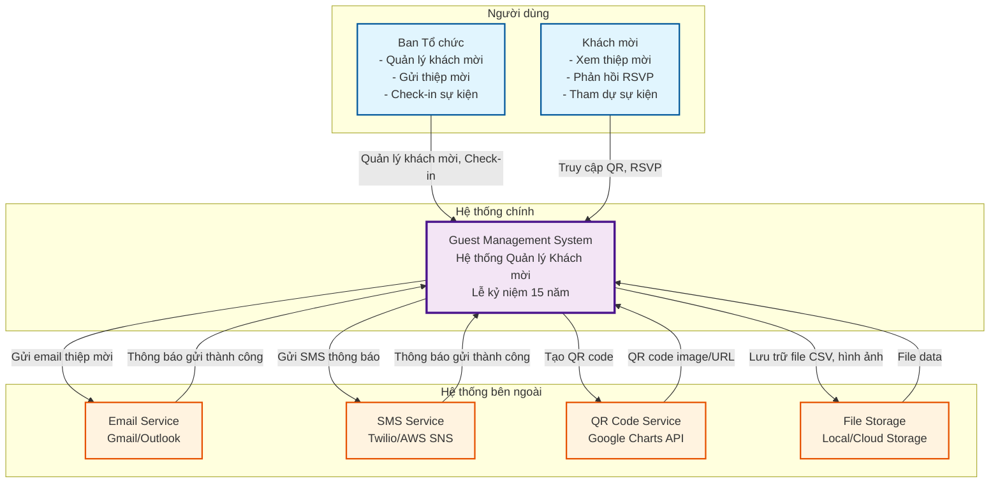
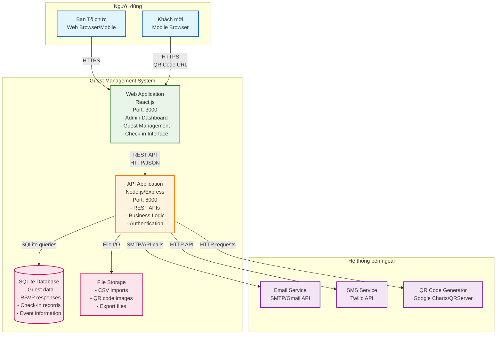
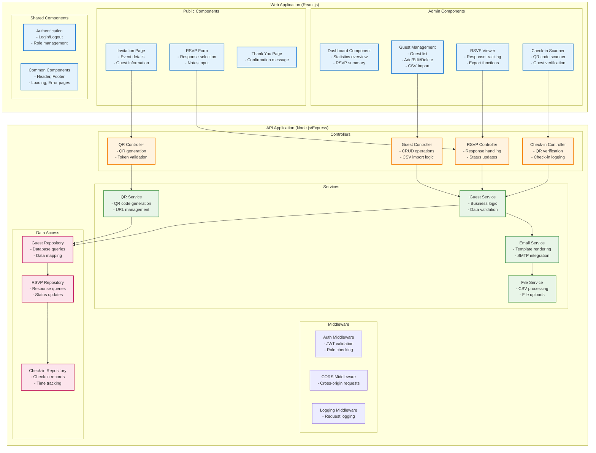
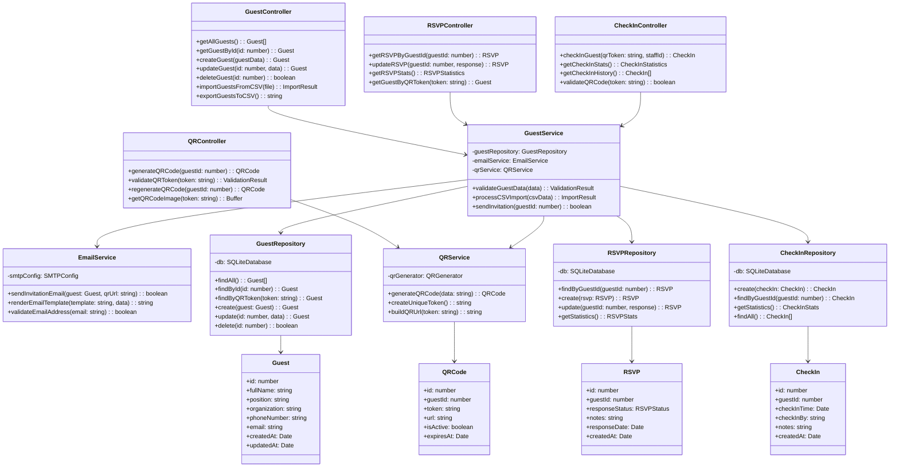

# 4C Model - Hệ thống Quản lý Khách mời

## 1. Context Diagram - Bối cảnh hệ thống

## 2. Container Diagram - Kiến trúc containers

## 3. Component Diagram - Thành phần hệ thống

## 4. Code Diagram - Chi tiết implementation

## Tóm tắt kiến trúc 4C

### 1. Context (Bối cảnh)
- **Actors**: Ban tổ chức, Khách mời
- **External Systems**: Email Service, SMS Service, QR Code Service, File Storage
- **Main System**: Guest Management System

### 2. Containers (Container)
- **Web Application**: React.js frontend (Port 3000)
- **API Application**: Node.js/Express backend (Port 8000)
- **Database**: SQLite database
- **File Storage**: Local file system

### 3. Components (Thành phần)
- **Frontend**: Admin components, Public components, Shared components
- **Backend**: Controllers, Services, Middleware, Repositories
- **Clear separation of concerns và single responsibility**

### 4. Code (Mã nguồn)
- **Detailed class structures** với methods và properties
- **Clear relationships** giữa các classes
- **Repository pattern** cho data access
- **Service pattern** cho business logic