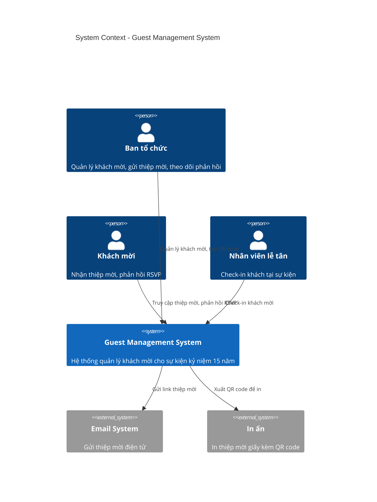
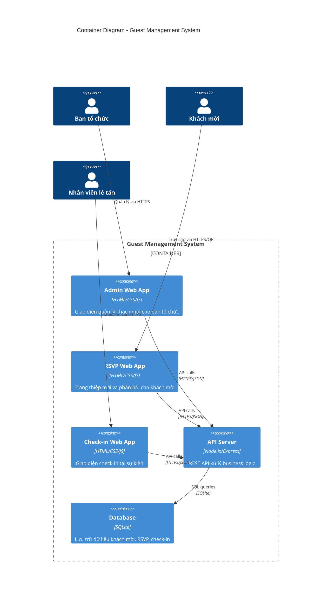
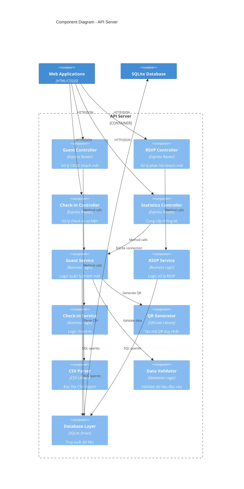
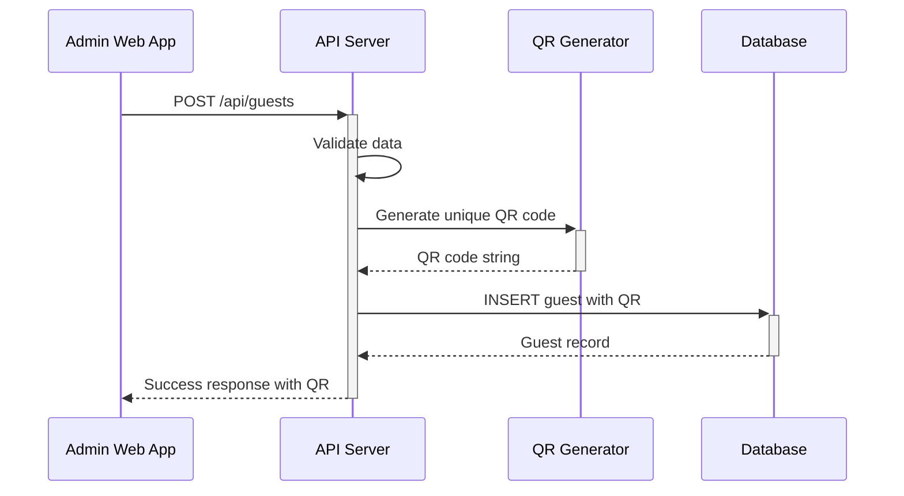
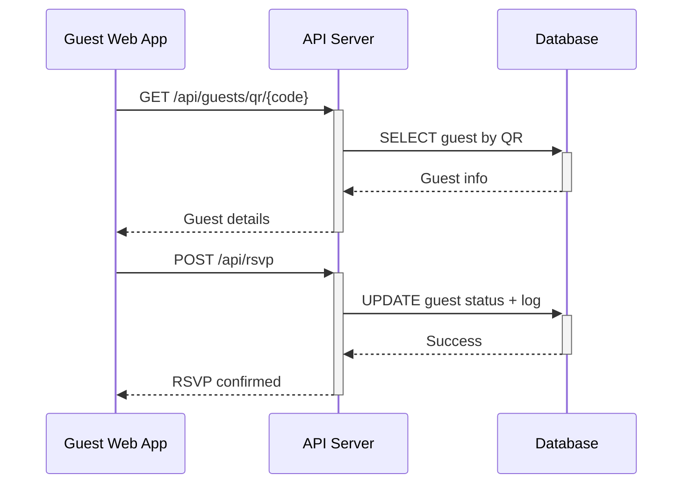
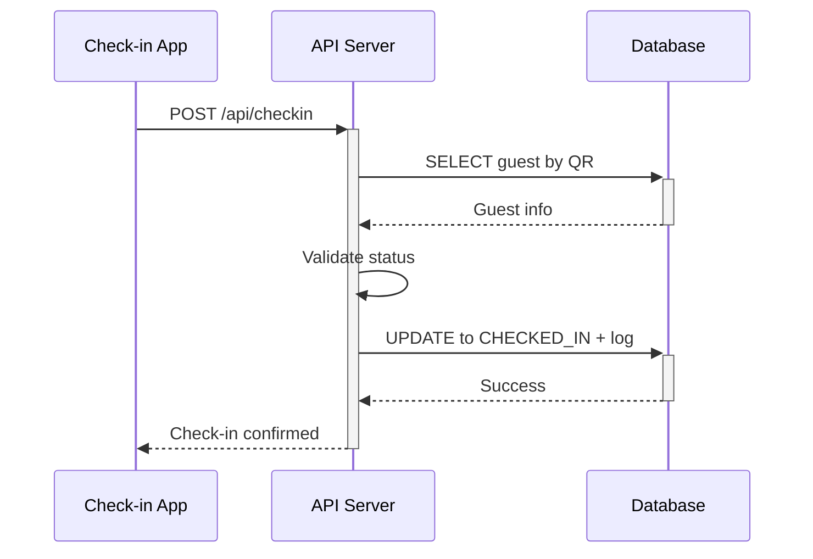

# Mô hình 4C - Guest Management System

Tài liệu này mô tả kiến trúc hệ thống Guest Management System theo mô hình 4C: Context, Container, Component và Code.

## Level 1: Context Diagram



## Level 2: Container Diagram



## Level 3: Component Diagram - API Server



## Level 4: Code Diagram - Guest Service

```mermaid
classDiagram
    class GuestService {
        -dbLayer: DatabaseLayer
        -qrGenerator: QRGenerator
        -csvParser: CSVParser
        -validator: Validator
        
        +createGuest(guestData): Promise~Guest~
        +importGuestsFromCSV(filePath): Promise~Guest[]~
        +getAllGuests(): Promise~Guest[]~
        +getGuestByQR(qrCode): Promise~Guest~
        +generateQRCode(guestId): string
        +validateGuestData(data): ValidationResult
    }
    
    class Guest {
        +id: number
        +name: string
        +position: string
        +organization: string
        +phone: string
        +qr_code: string
        +status: GuestStatus
        +created_at: Date
        
        +toJSON(): object
        +isValid(): boolean
    }
    
    class DatabaseLayer {
        -db: SQLiteDatabase
        
        +createGuest(guest): Promise~Guest~
        +findGuestByQR(qrCode): Promise~Guest~
        +getAllGuests(): Promise~Guest[]~
        +updateGuestStatus(id, status): Promise~void~
        +getStatistics(): Promise~Stats~
    }
    
    class QRGenerator {
        +generateUniqueCode(): string
        +createQRImage(code): Promise~Buffer~
    }
    
    class CSVParser {
        +parseFile(filePath): Promise~GuestData[]~
        +validateHeaders(headers): boolean
    }
    
    class Validator {
        +validateGuestData(data): ValidationResult
        +isValidPhone(phone): boolean
        +isValidName(name): boolean
    }
    
    <<enumeration>> GuestStatus
    GuestStatus : PENDING
    GuestStatus : ACCEPTED  
    GuestStatus : DECLINED
    GuestStatus : CHECKED_IN
    
    GuestService --> Guest
    GuestService --> DatabaseLayer
    GuestService --> QRGenerator
    GuestService --> CSVParser
    GuestService --> Validator
    Guest --> GuestStatus
```

## Luồng dữ liệu chính

### 1. Thêm khách mời mới


### 2. Phản hồi RSVP


### 3. Check-in sự kiện


## Deployment Architecture

```mermaid
deployment
    node "Server Environment" {
        node "Node.js Runtime" {
            artifact "GMS API Server"
            artifact "Static File Server"
        }
        
        node "File System" {
            artifact "SQLite Database"
            artifact "Static Assets"
            artifact "QR Code Images"
        }
    }
    
    node "Client Devices" {
        node "Admin Browser" {
            artifact "Admin Web App"
        }
        
        node "Guest Mobile/Browser" {
            artifact "RSVP Web App"  
        }
        
        node "Staff Device" {
            artifact "Check-in Web App"
        }
    }
```

## Technology Stack

| Layer | Technology | Rationale |
|-------|------------|-----------|
| **Frontend** | HTML5, CSS3, Vanilla JavaScript | Simple, no framework dependencies |
| **Backend** | Node.js + Express.js | Fast development, JSON native |
| **Database** | SQLite | Lightweight, embedded, no server setup |
| **QR Generation** | qrcode npm package | Simple, reliable QR generation |
| **CSV Parsing** | csv-parser npm package | Handle CSV import efficiently |
| **Styling** | Pure CSS with Flexbox/Grid | Responsive without frameworks |
| **Hosting** | Single server deployment | All-in-one solution |

## Security Considerations

1. **Input Validation**: Server-side validation for all inputs
2. **QR Code Security**: UUID-based codes prevent guessing
3. **Rate Limiting**: Prevent brute force attacks
4. **CORS Policy**: Restrict cross-origin requests
5. **Data Sanitization**: Clean user inputs before database storage