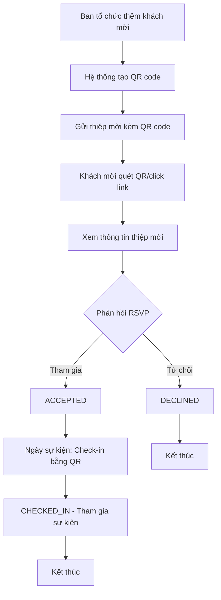

# Business Analysis (BA) - Guest Management System

## User Stories và Acceptance Criteria

### Vai trò: Ban tổ chức (Admin)

#### US-001: Quản lý thông tin khách mời
**Là** Ban tổ chức  
**Tôi muốn** thêm và quản lý thông tin khách mời  
**Để** có danh sách đầy đủ khách mời cho sự kiện

**Acceptance Criteria:**
- [x] Có thể thêm khách mời mới với đầy đủ thông tin: Họ tên, chức vụ, tổ chức, số điện thoại
- [x] Có thể import danh sách khách mời từ file CSV
- [x] Hiển thị danh sách tất cả khách mời đã thêm
- [x] Validate thông tin bắt buộc trước khi lưu
- [x] Thông báo thành công/lỗi khi thêm khách mời

#### US-002: Cấp phát QR Code cho khách mời
**Là** Ban tổ chức  
**Tôi muốn** tạo QR code duy nhất cho từng khách mời  
**Để** gửi thiệp mời kèm link QR code

**Acceptance Criteria:**
- [x] Mỗi khách mời có một mã QR duy nhất
- [x] QR code được tạo tự động khi thêm khách mời
- [x] Có thể tạo lại QR code nếu cần
- [x] QR code dẫn đến trang RSVP với thông tin khách mời
- [x] Hiển thị QR code dưới dạng hình ảnh có thể tải xuống

#### US-003: Theo dõi phản hồi khách mời
**Là** Ban tổ chức  
**Tôi muốn** xem trạng thái phản hồi của từng khách mời  
**Để** biết số lượng khách tham gia và chuẩn bị phù hợp

**Acceptance Criteria:**
- [x] Hiển thị thống kê tổng quan: tổng số khách, đã phản hồi, chưa phản hồi, tham gia, từ chối
- [x] Hiển thị danh sách khách mời với trạng thái chi tiết
- [x] Cập nhật thời gian thực khi khách phản hồi
- [x] Phân loại khách theo trạng thái: PENDING, ACCEPTED, DECLINED
- [x] Xuất báo cáo danh sách khách tham gia

#### US-004: Check-in khách tại sự kiện
**Là** Ban tổ chức  
**Tôi muốn** quét QR code để check-in khách tại sự kiện  
**Để** ghi nhận sự tham gia và quản lý lượng khách

**Acceptance Criteria:**
- [x] Quét QR code để tìm thông tin khách mời
- [x] Hiển thị thông tin khách trước khi check-in
- [x] Xác nhận check-in và cập nhật trạng thái
- [x] Không cho phép check-in trùng lặp
- [x] Hiển thị thống kê thời gian thực số khách đã check-in
- [x] Ghi log thời gian check-in

### Vai trò: Khách mời

#### US-005: Nhận và xem thiệp mời
**Là** Khách mời  
**Tôi muốn** xem thiệp mời và thông tin sự kiện  
**Để** hiểu rõ về sự kiện và đưa ra quyết định tham gia

**Acceptance Criteria:**
- [x] Truy cập được trang thiệp mời qua QR code/link
- [x] Hiển thị thông tin cá nhân: họ tên, chức vụ, tổ chức
- [x] Hiển thị thông tin sự kiện: tên, thời gian, địa điểm, chương trình
- [x] Giao diện thân thiện trên mobile và desktop
- [x] Load nhanh và hoạt động offline (cached)

#### US-006: Phản hồi tham gia sự kiện (RSVP)
**Là** Khách mời  
**Tôi muốn** xác nhận tham gia hoặc từ chối lời mời  
**Để** thông báo quyết định của mình với ban tổ chức

**Acceptance Criteria:**
- [x] Có 2 tùy chọn rõ ràng: "Tham gia" và "Từ chối"
- [x] Xác nhận lại quyết định trước khi gửi
- [x] Hiển thị thông báo thành công sau khi gửi phản hồi
- [x] Không thể thay đổi phản hồi sau khi đã gửi
- [x] Hoạt động trên mọi thiết bị (responsive design)

#### US-007: Check-in tại sự kiện
**Là** Khách mời  
**Tôi muốn** được check-in nhanh chóng tại sự kiện  
**Để** tham gia sự kiện một cách thuận tiện

**Acceptance Criteria:**
- [x] QR code của tôi được quét nhanh chóng
- [x] Thông tin cá nhân hiển thị chính xác
- [x] Check-in chỉ cần 1 bước xác nhận
- [x] Nhận thông báo check-in thành công
- [x] Không cần thao tác phức tạp từ phía khách mời

## Quy trình nghiệp vụ tổng thể

## Ma trận đánh giá độ ưu tiên

| User Story | Business Value | Technical Complexity | Priority |
|------------|----------------|---------------------|----------|
| US-001 | High | Low | High |
| US-002 | High | Medium | High |
| US-003 | High | Low | High |
| US-004 | High | Medium | High |
| US-005 | High | Low | High |
| US-006 | High | Low | High |
| US-007 | Medium | Low | Medium |

## Rủi ro và giải pháp

### Rủi ro kỹ thuật
- **QR code bị trùng lặp**: Sử dụng UUID đảm bảo tính duy nhất
- **Mất kết nối internet**: Cache thông tin cơ bản trên client
- **Check-in trùng lặp**: Kiểm tra trạng thái trước khi cho phép check-in

### Rủi ro nghiệp vụ  
- **Khách mời không biết cách sử dụng QR**: Cung cấp hướng dẫn rõ ràng
- **Thay đổi quyết định RSVP**: Cho phép admin cập nhật thủ công
- **Quá tải check-in**: Tối ưu hóa performance và chuẩn bị multiple devices