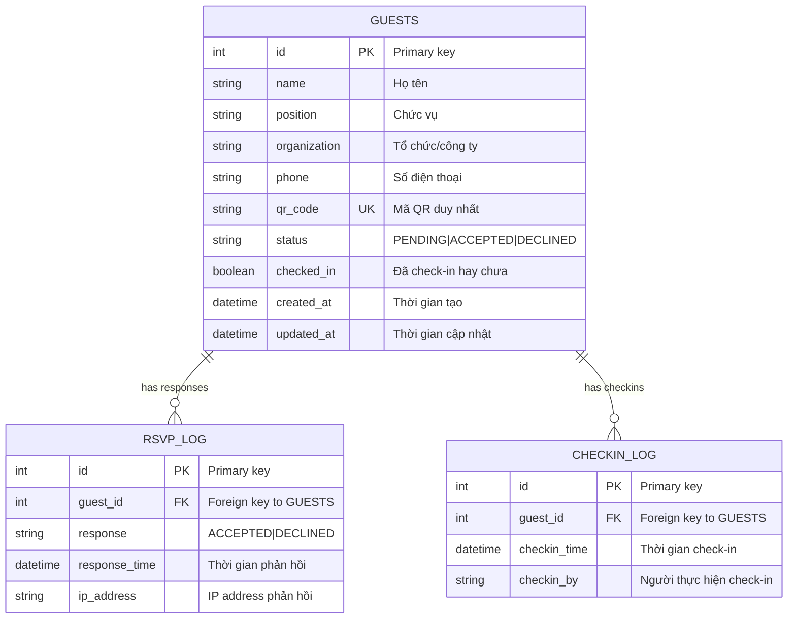

# Database Schema (ERD)

## Entity Relationship Diagram

## Tables Description

### GUESTS
Bảng chính chứa thông tin khách mời:
- `id`: Khóa chính
- `name`: Họ tên khách mời
- `position`: Chức vụ
- `organization`: Tổ chức/công ty
- `phone`: Số điện thoại
- `qr_code`: Mã QR duy nhất cho mỗi khách mời
- `status`: Trạng thái phản hồi (PENDING/ACCEPTED/DECLINED)
- `checked_in`: Boolean xác định đã check-in chưa
- `created_at`, `updated_at`: Timestamps

### RSVP_LOG
Log phản hồi của khách mời:
- Ghi lại lịch sử phản hồi
- Có thể theo dõi thời gian và IP phản hồi

### CHECKIN_LOG
Log check-in tại sự kiện:
- Ghi lại thời gian check-in
- Người thực hiện check-in