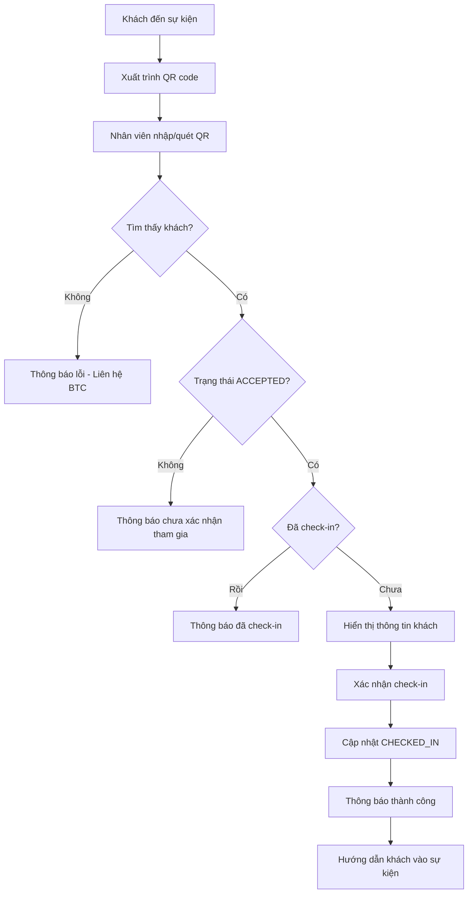

# Quy trình Vận hành Hệ thống - Guest Management System

## Tổng quan quy trình

Hệ thống Guest Management System (GMS) được thiết kế để quản lý toàn bộ quy trình từ lời mời đến check-in sự kiện. Dưới đây là quy trình vận hành chi tiết từng bước.

## Quy trình chính: Nhập khách mời → Gửi QR → Khách phản hồi → Check-in tại sự kiện

### Giai đoạn 1: Chuẩn bị danh sách khách mời

#### 1.1. Khởi động hệ thống
```bash
# Tại thư mục dự án
./start.sh
```

#### 1.2. Truy cập Admin Dashboard
- Mở trình duyệt và truy cập: `frontend/index.html`
- Giao diện quản lý khách mời sẽ hiển thị

#### 1.3. Nhập danh sách khách mời

**Phương án A: Thêm thủ công**
1. Điền form "Thêm khách mời mới":
   - Họ tên (bắt buộc)
   - Chức vụ (bắt buộc)
   - Tổ chức/Công ty (bắt buộc)
   - Số điện thoại (bắt buộc)
2. Click "Thêm khách mời"
3. Hệ thống tự động tạo QR code duy nhất
4. QR code hiển thị ngay lập tức

**Phương án B: Import từ CSV**
1. Chuẩn bị file CSV theo định dạng:
   ```csv
   name,position,organization,phone
   Nguyễn Văn A,Giám đốc,Công ty ABC,0123456789
   Trần Thị B,Trưởng phòng,Công ty XYZ,0987654321
   ```
2. Click "Import từ CSV"
3. Chọn file CSV đã chuẩn bị
4. Click "Upload"
5. Hệ thống xử lý và tạo QR code cho tất cả khách mời

#### 1.4. Kiểm tra danh sách
- Danh sách khách mời sẽ hiển thị trong bảng
- Mỗi khách có trạng thái: PENDING (chưa phản hồi)
- QR code có thể tải xuống dưới dạng hình ảnh

### Giai đoạn 2: Gửi thiệp mời kèm QR code

#### 2.1. Lấy link thiệp mời
Mỗi khách mời sẽ có link dạng:
```
frontend/rsvp.html?qr=[QR_CODE_HERE]
```

#### 2.2. Phương thức gửi thiệp mời

**Thiệp mời điện tử:**
- Gửi email kèm link thiệp mời
- Gửi tin nhắn SMS với link
- Chia sẻ qua mạng xã hội

**Thiệp mời giấy:**
- Tải QR code dưới dạng hình ảnh
- In thiệp mời kèm QR code
- Gửi bưu điện hoặc trao tay

#### 2.3. Template nội dung thiệp mời
```
🎉 THIỆP MỜI KỶ NIỆM 15 NĂM THÀNH LẬP CÔNG TY A

Kính gửi: [TÊN KHÁCH MỜI]
Chức vụ: [CHỨC VỤ]
Tổ chức: [TÊN TỔ CHỨC]

Công ty A trân trọng kính mời Anh/Chị tham dự:
🎊 LỄ KỶ NIỆM 15 NĂM THÀNH LẬP
📅 Thời gian: [NGÀY GIỜ]
📍 Địa điểm: [ĐỊA ĐIỂM]

👆 Vui lòng click link hoặc quét QR code để xác nhận tham gia:
🔗 [LINK_THIEP_MOI]

📞 Liên hệ: [SỐ ĐIỆN THOẠI]
📧 Email: [EMAIL]
```

### Giai đoạn 3: Khách mời phản hồi (RSVP)

#### 3.1. Khách mời truy cập thiệp mời
- Click vào link hoặc quét QR code
- Trang RSVP hiển thị thông tin:
  - Thông tin cá nhân khách mời
  - Chi tiết sự kiện
  - Chương trình cơ bản

#### 3.2. Khách mời đưa ra quyết định
- **Tham gia**: Click nút "Tham gia" → Trạng thái: ACCEPTED
- **Từ chối**: Click nút "Từ chối" → Trạng thái: DECLINED
- Hệ thống hiển thị thông báo xác nhận

#### 3.3. Admin theo dõi phản hồi
- Truy cập Admin Dashboard
- Xem thống kê real-time:
  - Tổng số khách mời
  - Số lượng đã phản hồi
  - Số lượng tham gia
  - Số lượng từ chối
  - Số lượng chưa phản hồi

### Giai đoạn 4: Chuẩn bị sự kiện

#### 4.1. Lập danh sách khách tham gia
- Xuất danh sách khách có trạng thái ACCEPTED
- In danh sách để đối chiếu

#### 4.2. Chuẩn bị thiết bị check-in
- Laptop/tablet có kết nối internet
- Truy cập: `frontend/checkin.html`
- Test thử chức năng check-in

#### 4.3. Hướng dẫn nhân viên lễ tân
```
HƯỚNG DẪN CHECK-IN KHÁCH MỜI:

1. Yêu cầu khách mời xuất trình QR code (trên điện thoại hoặc thiệp giấy)
2. Nhập QR code vào ô tìm kiếm hoặc quét bằng camera
3. Kiểm tra thông tin khách mời hiển thị trên màn hình
4. Xác nhận: "Anh/Chị [TÊN] của [TỔ CHỨC] phải không?"
5. Click nút "Check-in" nếu đúng thông tin
6. Thông báo thành công sẽ hiển thị
7. Hướng dẫn khách vào sự kiện

LƯU Ý:
- Nếu khách chưa phản hồi RSVP: Thông báo lỗi, liên hệ ban tổ chức
- Nếu khách từ chối tham gia: Thông báo lỗi, kiểm tra lại
- Nếu khách đã check-in: Thông báo đã check-in trước đó
```

### Giai đoạn 5: Check-in tại sự kiện

#### 5.1. Quy trình check-in từng khách


#### 5.2. Theo dõi real-time
- Admin Dashboard hiển thị thống kê live:
  - Số khách đã check-in
  - Tỉ lệ tham gia thực tế
  - Danh sách khách đã/chưa đến

#### 5.3. Xử lý trường hợp đặc biệt

**Khách mời không có QR code:**
1. Tìm kiếm bằng tên và số điện thoại
2. Xác nhận thông tin cá nhân
3. Check-in thủ công bằng Admin Dashboard

**QR code không đọc được:**
1. Nhập thủ công mã QR (chuỗi UUID)
2. Hoặc tìm kiếm bằng thông tin cá nhân

**Khách không có trong danh sách:**
1. Liên hệ ban tổ chức để xác nhận
2. Có thể thêm mới vào hệ thống nếu được phép

### Giai đoạn 6: Sau sự kiện

#### 6.1. Xuất báo cáo cuối cùng
- Tổng số khách mời: X người
- Đã phản hồi tham gia: Y người
- Thực tế tham gia: Z người
- Tỉ lệ tham gia: Z/X * 100%

#### 6.2. Sao lưu dữ liệu
```bash
# Sao lưu database
cp backend/gms.db backup/gms_[NGÀY].db

# Sao lưu toàn bộ dự án
tar -czf gms_backup_[NGÀY].tar.gz gms/
```

#### 6.3. Phân tích và cải thiện
- Đánh giá quy trình vận hành
- Ghi nhận các vấn đề phát sinh
- Đề xuất cải thiện cho lần tiếp theo

## Timeline thực hiện

### 4 tuần trước sự kiện
- [ ] Hoàn thiện danh sách khách mời
- [ ] Import vào hệ thống GMS
- [ ] Tạo QR code cho tất cả khách

### 3 tuần trước sự kiện
- [ ] Gửi thiệp mời kèm QR code
- [ ] Theo dõi phản hồi hàng ngày

### 1 tuần trước sự kiện
- [ ] Nhắc nhở khách chưa phản hồi
- [ ] Chuẩn bị thiết bị check-in
- [ ] Huấn luyện nhân viên lễ tân

### Ngày sự kiện
- [ ] Setup hệ thống check-in
- [ ] Thực hiện check-in khách mời
- [ ] Theo dõi thống kê real-time

### Sau sự kiện
- [ ] Xuất báo cáo tổng kết
- [ ] Sao lưu dữ liệu
- [ ] Phân tích và cải thiện

## Checklist vận hành

### Trước sự kiện
- [ ] Hệ thống GMS hoạt động ổn định
- [ ] Danh sách khách mời đã đầy đủ
- [ ] QR code đã được tạo và gửi
- [ ] Thiết bị check-in đã sẵn sàng
- [ ] Nhân viên đã được huấn luyện
- [ ] Backup dữ liệu đã được tạo

### Trong sự kiện
- [ ] Kết nối internet ổn định
- [ ] Hệ thống check-in hoạt động
- [ ] Nhân viên biết cách xử lý lỗi
- [ ] Admin theo dõi thống kê
- [ ] Có phương án backup khi gặp sự cố

### Sau sự kiện
- [ ] Xuất báo cáo hoàn chỉnh
- [ ] Sao lưu dữ liệu cuối cùng
- [ ] Đánh giá quy trình vận hành
- [ ] Ghi nhận lesson learned

## Liên hệ hỗ trợ kỹ thuật

**Trong giờ hành chính:**
- Email: support@company.com
- Phone: 1900-xxxx

**Ngoài giờ/Khẩn cấp:**
- Hotline: 0901-xxx-xxx
- Kỹ thuật viên trực: [Tên + SĐT]

**Tài liệu tham khảo:**
- User Guide: `docs/v1.0/user-guide.md`
- API Documentation: `docs/v1.0/api.md`
- Database Schema: `docs/v1.0/erd.md`